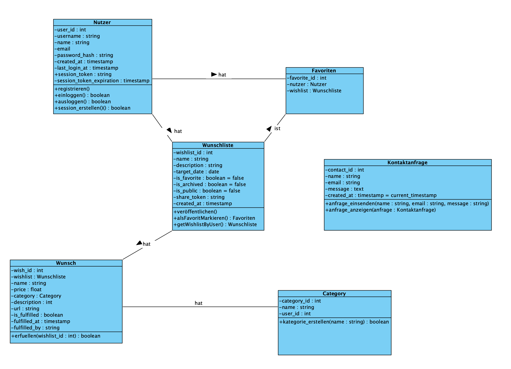
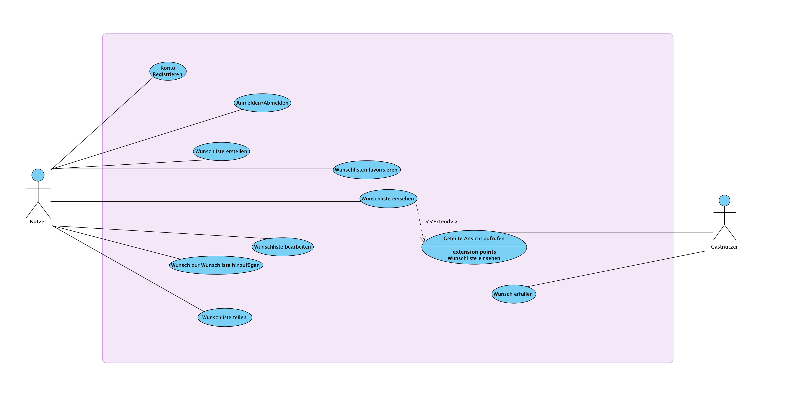
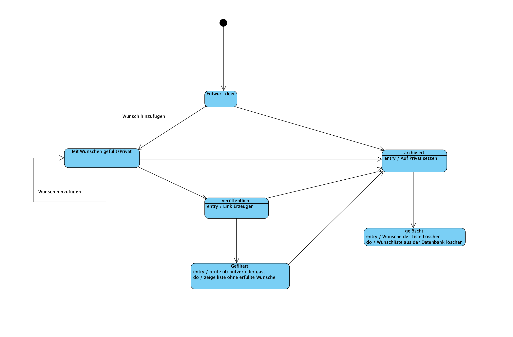
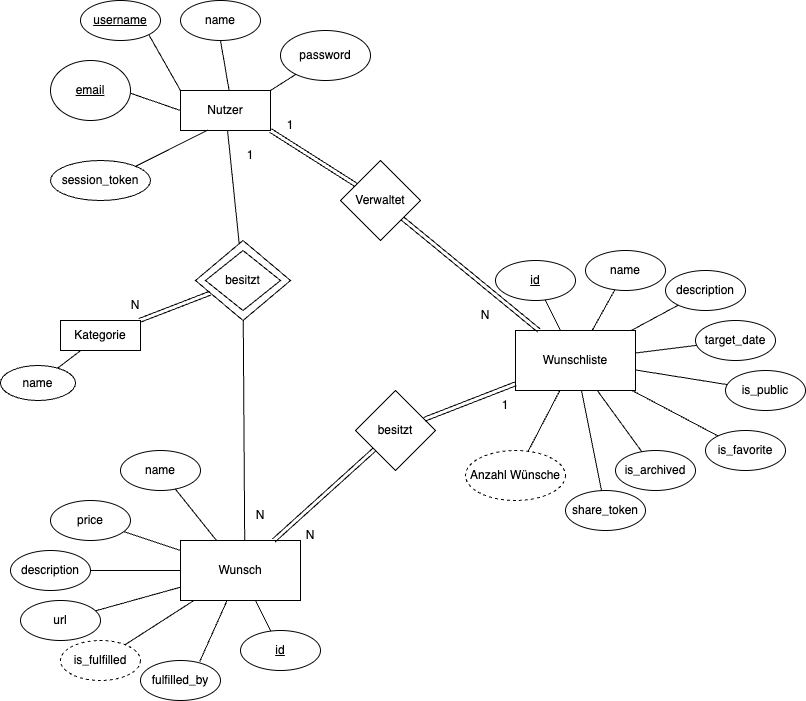
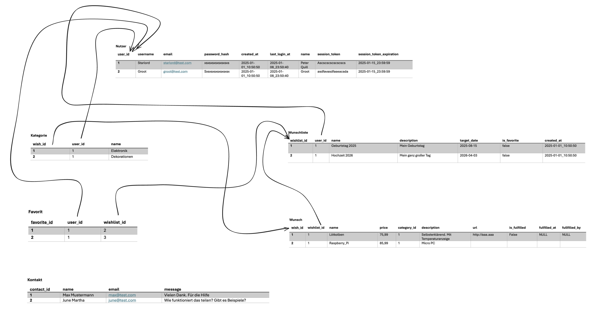
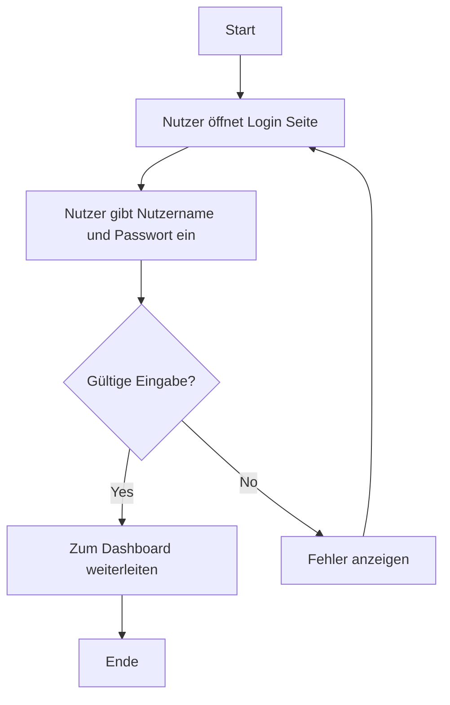
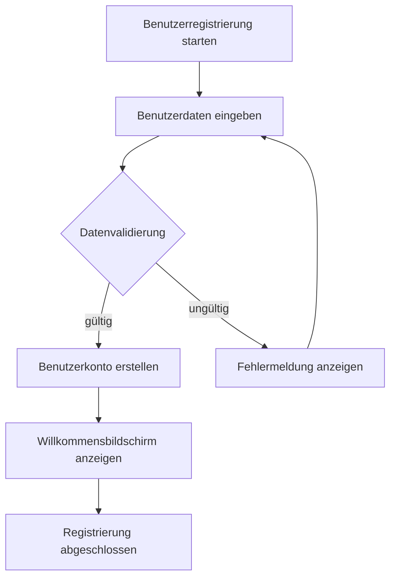
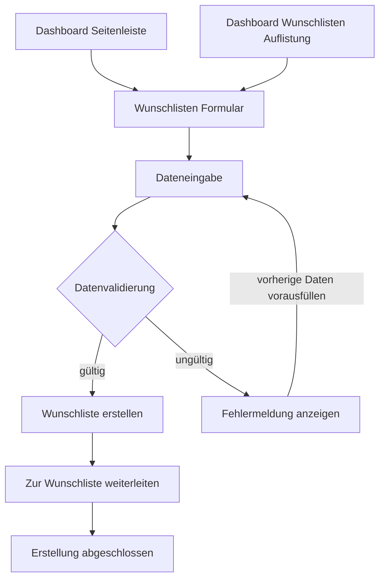
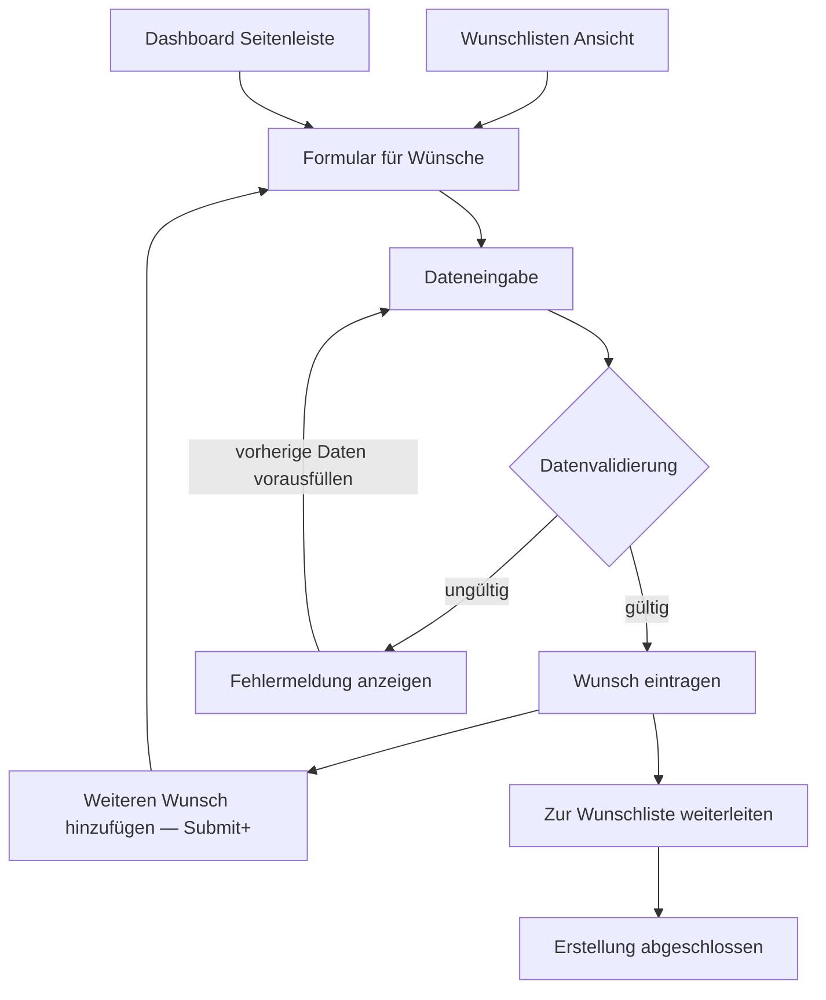
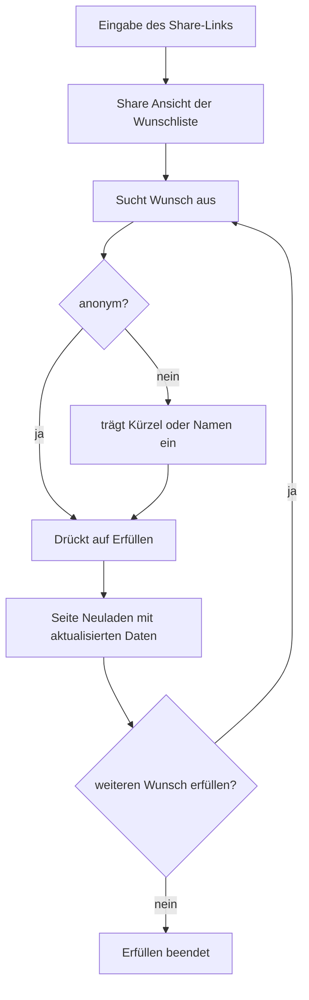

# UML Beschreibungen

Damit die App auch ein Grundgerüst hast und besser entwickelt werden kann müssen die Inhalte und Funktionen vorab beschrieben werden. Sie bilden quasi eine Blaupause für das Gesamte Projekt. Somit ist hier ein Sammelsorium an Beschreibungen der Funktionen der App.

> ![NOTE] Bilder
> Alle Bilder der Diagramme sind auch im Ordner [`./assets/`](./assets/) zu finden.

## Klassendiagram

Hier sind die wichtigsten Klassen der App WunschNest.

Wie man sieht steht die Klasse Wunschliste im Mittelpunkt. Sie bildet die Zentrale Einheit, um die man die ganze Zeit interagiert.

## Use Case Diagramm

Die möglichen Nutzen unserer App

## Zustandsdiagramm

Dieses Zustandsdiagram beschreibt den Zustand einer Wunschliste.

## EER Diagramm

## Relations Diagramm

## User Flows

Ein Nutzer der App kann unterschiedliche Erfahrungen während der Benutzung der App machen. Dies kann ich flows beschrieben werden in Abläufen. Es kann unterschiedliche Flows für einen Nutzer geben:

- [x] Login
- [x] Registrierung
- [x] Ausloggen
- [x] Wunschlisten/Wünsche erstellen
- [ ] Kategorien erstellen
- [ ] Favoriten hinzufügen
- [ ] Kategorien bearbeiten
- [x] Erfüller erfüllt Wunsch

### Login

Der Login ist sehr einfach gestaltet und zunächst werden auf komplexere Authentifizierung verzichtet.

---

### Registrierung

Ein neuer Nutzer möchte sich ja auch registieren können um anzufangen eine Liste anzulegen.

---

### Wunschlisten erstellen

Das ist die Zentrale Einheit, wie im Klassendiagramm dargestellt. Deshalb muss diese Funktion einfach erreichbar sein.

---

### Wünsche eintragen

---

### Erfüller erfüllt Wunsch

---

##
