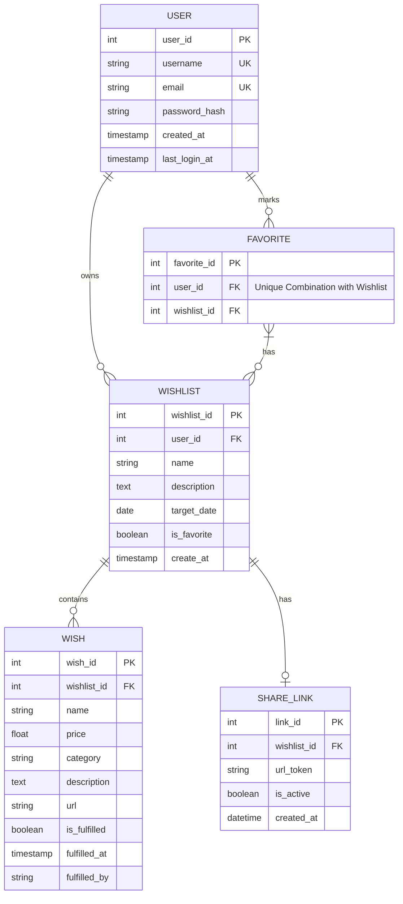

# Datenbank Design

Die Datenbank liefert am Ende unsere strukturierten Daten, damit wir diese auch vernünftig darstellen können. Ohne strukturierte Daten können wir nicht arbeiten.

## Benutzer

Zunächst brauchen wir eine Tabelle für Benutzer, weil diese sich einloggen können und anhand diesem Benutzer auch die Wünsche zugeordnet werden. Die minimalsten Daten die wir brauchen sind der Benutzername/Email Adresse und Passwort. Hilfreich natürlich, um die Anwendung schöner zu machen ist ein Name. Für die Datenbank benötigen wir noch eine einzigartige ID. Daraus ergeben sich folgende Daten:

- Email
- Passwort
- Name

# Wünsche

Um dieses Thema zu bewältigen muss ich wissen wie man generell mit den Daten interagieren möchte. Somit komme folgende Beschreibung zustande:

> Ein Benutzer möchte eine Liste erstellen können und ggf. mehrere Listen. In diesen Listen will er Produkte oder Wünsche hinzufügen können. Am besten wäre es ein URL einzutragen wo die Daten automatisch eingeholt werden. Wenn das nicht klappt gibt der Benutzer

# Tabellen

## Benutzer Tabelle

Die Benutzer Tabelle ist die Tabelle um die Nutzer der Aplication zu ermöglichen. Also Das man weiß wer sich einloggt und welches Passwort dieser verwendet hat.
Die Tabelle wird mir folgendem Code erstellt:

```sql
CREATE TABLE IF NOT EXISTS users (
    id INT AUTO_INCREMENT PRIMARY KEY,
    username VARCHAR(50) NOT NULL UNIQUE,
    name VARCHAR(50) NOT NULL,
    email VARCHAR(100) NOT NULL UNIQUE,
    password_hash VARCHAR(255) NOT NULL,
    created_at TIMESTAMP DEFAULT CURRENT_TIMESTAMP,
    updated_at TIMESTAMP DEFAULT CURRENT_TIMESTAMP,
);
```

- id: Primärer Schlüssel damit man jeden Nutzer auch eindeutig zuordnen kann.
- username: Nutzername der auch eindeutig ist, also es gibt keinen Nutzernamen doppelt.
- email: Email Adresse des Nutzers
- password_hash: wir speichern keine Passwörter als Klartext. Sondern ein Hash womit das passwort dann abgeglichen wird.
- created_at: wann der Nutzer erstellt worden ist.
- updated_at: wann der Nutzereintrag zuletzt aktualisiert worden ist.

Hierfür wird der Controller `UserController.php` verwendet. Dieser beschreibt den Nutzer liest stellt alle Funktionenen die den Nutzer betreffen bereit. Daruntre sind folgende Funktionen:

- register($name, $email, $password) - Registriere einen Nutzer, also Füge in die Datenbank ein
- login($email, $password) - Prüfe die Logindaten gebe einen Bool zurück
- getUsers() - hole alle Nutzer aus der Datenbank
- getUser($id) - hole einen Nutzer anhand seiner ID
- getUserByEmail($email)
- getUserByUsername($username)
- getUserByUsernameOrEmail($kennung)

## Wunschlisten Tabelle

# Das Entity Relationship Diagram


