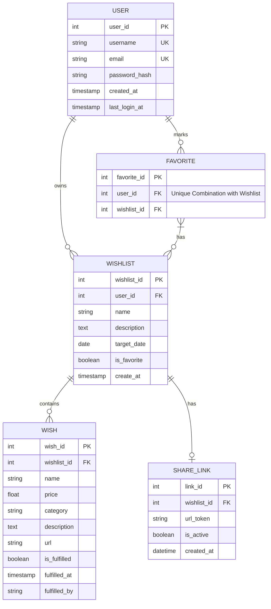
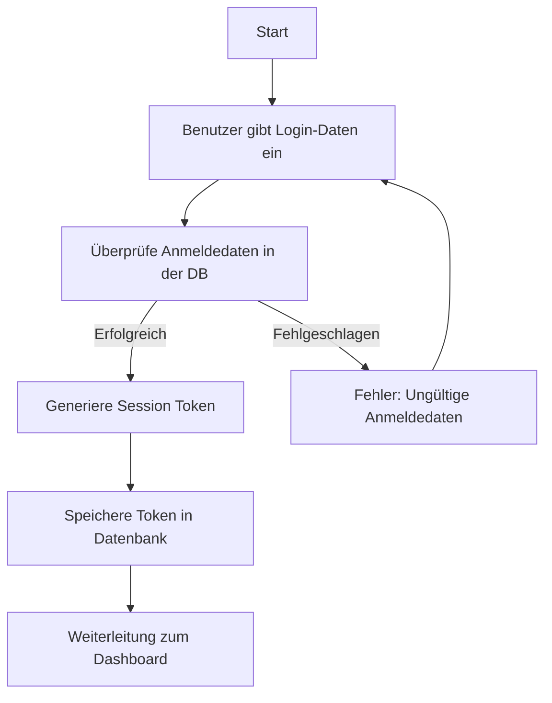
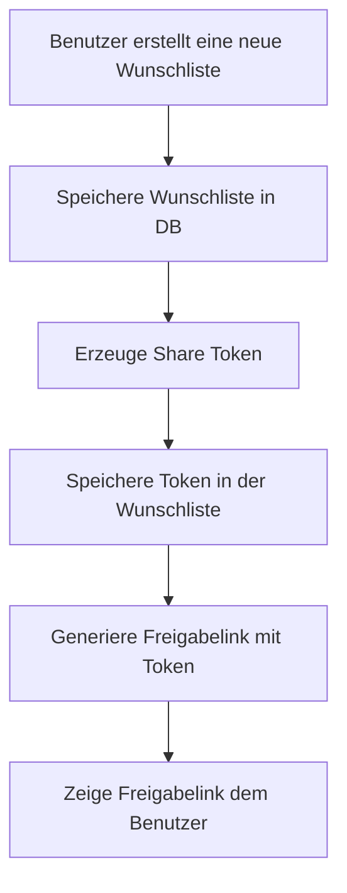
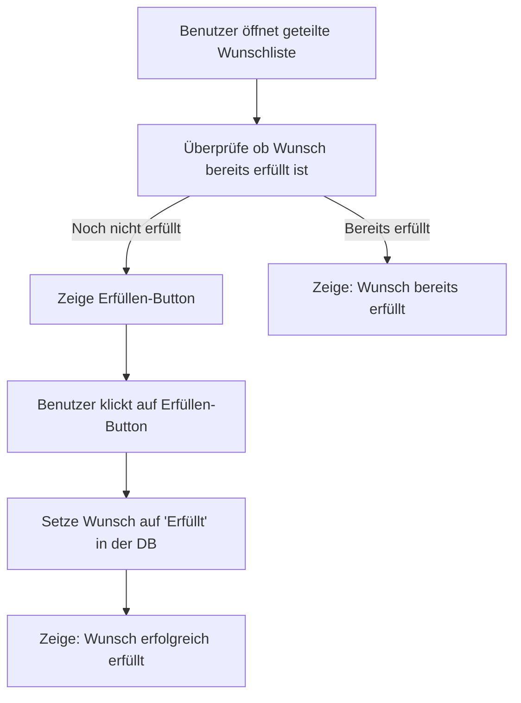
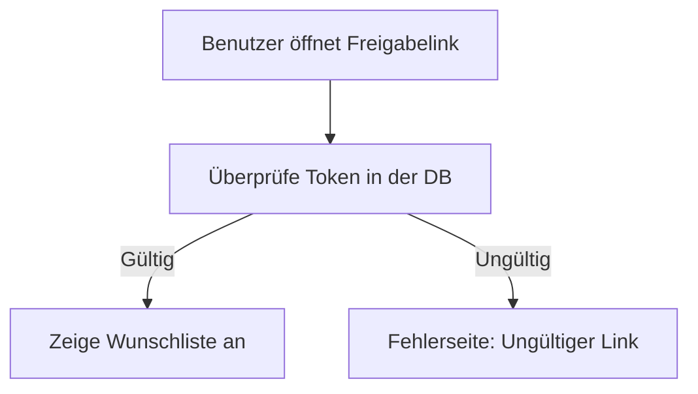

# Datenbank Design

Die Datenbank liefert am Ende unsere strukturierten Daten, damit wir diese auch vernünftig darstellen können. Ohne strukturierte Daten können wir nicht arbeiten. Für unsere App sind die Grundlegenden Einheiten die Wünsche und die Listen. Und die Struktur der Datenbank richtet sich nach den Interaktionen mit diesen Datenpunkten.

Overview der wichtigsten Eigenschaften und Interaktionen:

- Ein Nutzer möchte Wunschlisten anlegen und darin Wünsche abspeichern.
- Ein Nutzer möchte diese Listen mit anderen (hiernach Erfüller genannt), ohne dass diese Ein Konto besitzen teilen.
- Ein Erfüller erhält einen Link mit der er Einsicht in die Wunschliste erhält.
- Ein Erfüller kann einen ausgesuchten Wunsch erfüllen und mit einem Kürzel oder vollen Namen kenntlich machen, dass er diesen Wunsch erfüllen wird/erfüllt hat. Andere Können sehen, dass dieser Wunsch schon erfüllt wurde und von wem (wenn angegeben)
- Ein Nutzer sieht derweils nichts wer welchen Wunsch erfüllt hat, ehe das Datum nicht abgelaufen ist.

Aus diesen Groben Infos kann man schon einiges erkennen. Hieraus ableitend kann man sehen, dass man folgende Mindesttabellen benötigt:

- Nutzer
- Wunschlisten
- Wünsche
- Geteilte Listen

## Überblick / Entity Relationship Diagram



## Benutzer

Zunächst brauchen wir eine Tabelle für Benutzer, weil diese sich einloggen können und anhand diesem Benutzer auch die Wünsche zugeordnet werden. Die minimalsten Daten die wir brauchen sind der Benutzername/Email Adresse und Passwort. Hilfreich natürlich, um die Anwendung schöner zu machen ist ein Name. Für die Datenbank benötigen wir noch eine einzigartige ID. Daraus ergeben sich folgende Daten:

- Name
- Email / Nutzername
- Passwort

Für weitere Metadaten, um weiter Funktionen zu ermöglichen wäre folgendes möglich/geeignet:

- Erstellungs Zeitpunkt
  - So kann man sehen wie lange ein Nutzer schon auf der Platform ist.
- Zuletzt eingeloggt am
  - So kann man den Nutzer hinweisen, ob man das Konto dennoch behalten möchte.

## Wünsche

Wünsche sind das grundlegenste an dieser App. So muss man diese Interaktionen gut beschreiben. Die obige Beschriebung beschreibt schon mal die Mindestanforderungen und die Grundlegenden Funktionen, die gut funktionieren müssen. Daraus ergeben sich folgende Mindest Datenpunkte:

- name
- Wunschlisten ID
  - zu welcher Liste gehört der Wunsch
- Preis
- Beschreibun
- URL
- Erfüllt?
- Erfüllt von
- Erfüllt am

Desweiteren kann man hier natürlich noch einige weitere Funktionen anbieten die durch weitere Datenpunkte ergänzt werden können. Folgende Features kann man sich überlegen, die die Nutzerfreundlichkeit erhöhen könnten.

- Anzeige wann der Wunsch erstellt oder aktualisiert worden ist. Um irrelevante Geschenke zu vermeiden.
  - ggf. Berechnen wann ein Geschenk
- Sortierung/Eingruppierung der Wünsche in Preisklassen (Interessant für Gruppen in denen man sich ein Limit setzt).
- Zuordnung an eine Zielgruppe (Wünsche nur für den Partner, nur Für die Familie, nur für die Freunde, Nur für eine Clique) aber alle Wünsche in einer Gesamtliste (bsp. Geburtstag).

### Möglicher Flow

Der Ablauf könnte wie folgt dargestellt werden:



## Wunschlisten

Sie sind der Startpunkt des ganzen, weil man in diese die Wünsche einsortiert. Wichtig ist hier also ein grobe Beschreibung der nötigen Features:

- Ein Nutzer möchte eine Wunschliste bennenen
- Ein Nutzer möchte einer Wunschliste ggf. ein Zieldatum verleihen (Geburtstag, Hochzeit, etc.)
- ... möchte eine Beschreibung zur Liste anbieten, damit Erfüller die Liste einordnen können.
- Ein Nutzer möchte eine Liste favorisieren und in die Seitenleiste der App aufnehmen.
- Ein Nutzer möchte eine Liste archivieren, falls er später nochmal darauf zurückgreifen möchte.
- Ein Nutzer möchte eine Liste teilen und einen Link generieren/inaktiv setzen falsch fälschlicherweise publiziert.
- Ein Erfüller möchte sehen, wann eine Liste zuletzt aktualisiert worden ist. (Damit er nicht irrelevante Geschenke kauft).

### Mögliche Grunddaten

Das sind die Grundfunktionen und daraus ergeben sich zunächst folgende Datenpunkte:

- Eindeutige ID
- Benutzer_ID (FK)
- Name
- Beschreibung
- Ziel Datum
- ist Favorisiert
- Erstelldatum

### Mögliche Weitere Datenpunkte

-

### Flow Beschreibung

Der Flow um eine Liste zu erstellen und zu teilen könnte wie folgt aussehen.



Der Flow eines Erfüllers könnte es so aussehen:



## Share Links

Der Link ist die Hauptfunktion der App, da sie es erst ermöglicht die Liste ohn weiteres zu teilen. Folgendes muss mit dem Link nötig.

Features:

- Ein Link muss von jedem aufrufbar sein und zugänglich sein.
- Passwort sichern? aber hier erstmal zu viel.
- Jeder muss ein Wunsch erfüllen können (Formular)/Button mit Modal
- Ein Nutzer kann eine publizierte Liste wieder deaktivieren

Somit ergeben sich folgende Datenpunkte:

- wunschlisten_id (FK)
  - Welche Liste wurde geteilt
- user_id (FK)
  - zu wem gehört die Liste?
- token
  - Token um auf die Liste zuzugreifen
- active
  - Boolean - ob die Liste noch aktiv ist oder nicht.

Die Frage ist. kann ich diese Daten auch nicht einfach direkt in der Wunschlisten eintragen? ist das sinnvoll? Aber da dies hier erstmal nur simpel erstellt werden soll bietet sich eine integration in die Wunschlisten Tabelle.
Gründe für eine eigene Tabelle wäre es, wenn man folgende Aspekte integrieren möchte:

- Mehrere Links zum teilen. Also ggf. unterschiedliche Links für unterschiedliche Personen
- Tracking über die Links
- Auslauf (Expiration) der Links

Zunächst wird erstmal vom simplen Ansatz ausgegangen.



# Tabellen

## Benutzer Tabelle

Die Benutzer Tabelle ist die Tabelle um die Nutzer der Aplication zu ermöglichen. Also Das man weiß wer sich einloggt und welches Passwort dieser verwendet hat.
Die Tabelle wird mir folgendem Code erstellt:

```sql
CREATE TABLE IF NOT EXISTS users (
    id INT AUTO_INCREMENT PRIMARY KEY,
    username VARCHAR(50) NOT NULL UNIQUE,
    name VARCHAR(50) NOT NULL,
    email VARCHAR(100) NOT NULL UNIQUE,
    password_hash VARCHAR(255) NOT NULL,
    created_at TIMESTAMP DEFAULT CURRENT_TIMESTAMP,
    updated_at TIMESTAMP DEFAULT CURRENT_TIMESTAMP,
);
```

- id: Primärer Schlüssel damit man jeden Nutzer auch eindeutig zuordnen kann.
- username: Nutzername der auch eindeutig ist, also es gibt keinen Nutzernamen doppelt.
- email: Email Adresse des Nutzers
- password_hash: wir speichern keine Passwörter als Klartext. Sondern ein Hash womit das passwort dann abgeglichen wird.
- created_at: wann der Nutzer erstellt worden ist.
- updated_at: wann der Nutzereintrag zuletzt aktualisiert worden ist.

Hierfür wird der Controller `UserController.php` verwendet. Dieser beschreibt den Nutzer liest stellt alle Funktionenen die den Nutzer betreffen bereit. Daruntre sind folgende Funktionen:

- register($name, $email, $password) - Registriere einen Nutzer, also Füge in die Datenbank ein
- login($email, $password) - Prüfe die Logindaten gebe einen Bool zurück
- getUsers() - hole alle Nutzer aus der Datenbank
- getUser($id) - hole einen Nutzer anhand seiner ID
- getUserByEmail($email)
- getUserByUsername($username)
- getUserByUsernameOrEmail($kennung)

## Wunschlisten Tabelle

Die Tabelle wird benötigt um die Listen festzuhalten, aus den obigen Ausführungen kommt die Folgende Tabelle zustande.

```sql
CREATE TABLE IF NOT EXISTS wishlist (
    wishlist_id INT AUTO_INCREMENT PRIMARY KEY,
    user_id INT NOT NULL,
    name VARCHAR(255) NOT NULL,
    description TEXT,
    target_date DATE,
    is_favorite BOOLEAN DEFAULT FALSE,
    share_token VARCHAR(90) DEFAULT NULL,
    is_published BOOLEAN DEFAULT FALSE,
    created_at TIMESTAMP DEFAULT CURRENT_TIMESTAMP,
    FOREIGN KEY (user_id) REFERENCES users(user_id) ON DELETE CASCADE
);
```

## Wunsch Tabelle

Die einzelnen Wünsche stellen die einzelnen kleinen Einheiten der App dar. Hier muss ich Details festhalten, die dann für den Nutzer und für den Erfüller von Relevanz sein könnten, ohne es zu kompliziert zu machen. Aber natürlich komplexere Sachverhalte auch abzubilden.

```sql
CREATE TABLE IF NOT EXISTS wish (
    wish_id INT PRIMARY KEY AUTO_INCREMENT,
    wishlist_id INT NOT NULL,
    name VARCHAR(255) NOT NULL,
    price DECIMAL(10, 2) DEFAULT 0.00,
    category VARCHAR(255),
    description TEXT,
    url VARCHAR(255),
    created_at TIMESTAMP DEFAULT CURRENT_TIMESTAMP,
    is_fulfilled BOOLEAN DEFAULT FALSE,
    fulfilled_at TIMESTAMP,
    fulfilled_by VARCHAR(255),
    FOREIGN KEY (wishlist_id) REFERENCES WISHLIST(wishlist_id) ON DELETE CASCADE
);
```

## Favoriten Tabelle

Diese Tabelle ist wirklich nur eine Hilfstabelle dafür die Seitenleiste in der App einfacher darzustellen. Theoretisch ist es nicht wirklich notwendig und ich könnte mit einer filterung der Listen eines Nutzers diese Funktion bereits abbilden. Aber es ist eine gute Möglichkeit mal mit JOINS zu arbeiten, weswegen ich dieses simple Beispiel hier drin lasse.

Aufgrund der simplen Funktion ist die Tabelle auch nur sehr klein.

```sql
CREATE TABLE IF NOT EXISTS favorite (
    favorite_id INT PRIMARY KEY AUTO_INCREMENT,
    user_id INT NOT NULL,
    wishlist_id INT NOT NULL,
    FOREIGN KEY (user_id) REFERENCES USERS(user_id) ON DELETE CASCADE,
    FOREIGN KEY (wishlist_id) REFERENCES WISHLIST(wishlist_id) ON DELETE CASCADE,
    UNIQUE (user_id, wishlist_id)
);
```

Sie hat lediglich 3 Spalten an Datenpunkte, aber wichtig ist hier die Tabelle so einzuschränken, dass diese nur eine einzigartige Kombination aus nutzer und liste hat. Denn jeder sollte eine Liste nur ein mal favorisieren können.
