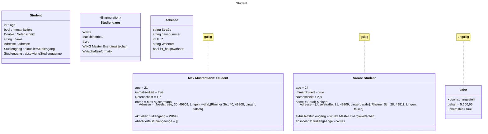
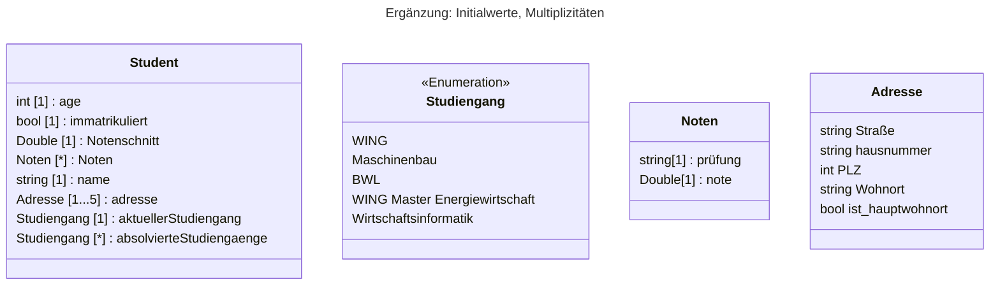
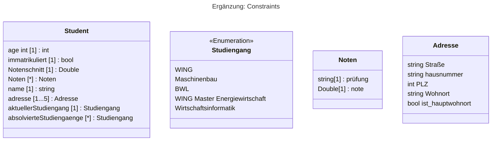
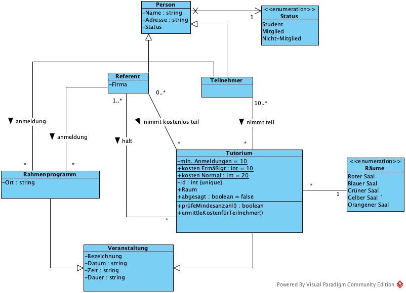
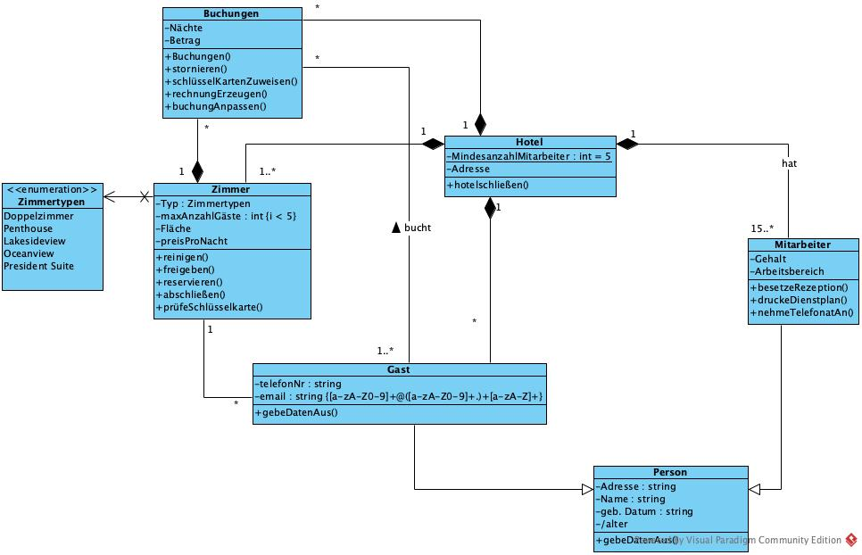

# UML Diagramme

Hier lernen wir die Bascis eines Klassendiagramms

## Übungsaufgabe 1

Erstellen Sie eine Klasse Student mit den Typen Boolean, Integer, Double, String,
eigene Klasse & eigener Aufzählungstyp.

Erstellen Sie zudem zwei gültige Objekte der Klasse Student und ein ungültiges
Objekt.

## Übungsaufgabe 2

Ergänzen Sie für alle Attribute der erstellen Klassen sinnvolle initiale Werte
Multiplizitäten. Nutzen Sie mind. eine unkonditionale und eine konditionale mit
maximalen Multiplizitäten > 1.

## Übungsaufgabe 3

Ergänzen Sie für alle Attribute der Klasse Hochschule sinnvolle Einschränkungen. Nutzen Sie mind. eine Zahlconstraint und eine Zeichenkettenconstraint. Generell gilt: Je genauer desto besser.

Folgende Contrains würde ich einfügen:

Klasse Noten:
note [1] {i<= 6 && i > 0} : Double

Klasse Adresse:
hausnummer[1] {[0-9]+[a-zA-Z]?} : string

Leider kann ich keine Constrains in Mermaid darstellen

## Übung 4

> Komplettieren Sie das Klassendiagramm zur Hochschule sodass alle bisherigen
> Elemente von Klassendiagrammen mindestens zweimal auftreten.
> Beschreiben Sie zudem mindestens die Klassen Student, Prüfung, Vorlesung.

Hier die UML Diagramme aus Visual Paradigm

## Übung 5/6

> Schränken Sie Zugriffe (durch private "-") ein für Attribute einer Hochschulklasse und überlegen Sie sich zudem generell und dafür sinnvolle öffentliche Operationen

> Ersetzen Sie (wenn möglich) Attribute bzw. ergänzen Sie
> • unidirektionale Assoziationen,
> • bidirektionale Assoziation sowie
> • Kompositionen.

## Übung: Tagung

> Eine Tagung ist zu organisieren. Für jeden Teilnehmer der Tagung werden Name, Adresse und Status gespeichert. Der Status wird differenziert in Student, Mitglied, Nichtmitglied. Jeder Teilnehmer kann sich für ein oder mehrere halbtägige Tutorien, die zusätzlich zum normalen Tagungsprogramm angeboten werden, anmelden.Jedes Tutorium wird über eine positive Nummer identifiziert. Zudem müssen Bezeichnung, Datum, Zeit & Dauer sowie der Raum festgehalten werden. Es gibt insgesamt 5 Tagungsräume, die farblich differenziert werden (Roter Saal, Blauer Saal, ... Grüner Saal). Alle Tutorien kosten gleich viel (20,10 Euro). Damit ein Tutorium stattfindet, müssen mindestens 10 Anmeldungen vorliegen. Ob ausreichend Anmeldungen vorliegen, soll geprüft werden können (ansonsten findet das Tutorium nicht statt). Jedes Tutorium wird mind. von einem Referenten gehalten.Für jeden Referenten werden dessen Name, Adresse, Status und Firma gespeichert. Ein Referent kann sich auch für ein oder mehrere Tutorien - anderer Referenten - anmelden und kann bei diesen kostenlos zuhören. Diese Anmeldungen zählen bei der Ermittlung der Mindestanmeldungen nicht mit. Ein Referent kann mehrere Tutorien anbieten. An einem Tutorium können mehrere Referenten kostenlos teilnehmen. Teilnehmer und Referenten können sich für einige Rahmenprogramme anmelden. Für jedes Rahmenprogramm werden dessen Bezeichnung,
> das Datum, Zeit & Dauer und der Ort gespeichert.

## Übung: Bank

> Wir betrachten eine neu gegründete Bank und ihre Kunden. Eine Person wird Kunde, wenn sie ein Konto eröffnet. Ein Kunde kann beliebig viele Konten eröffnen. Für jeden Kunden werden dessen Name, mindestens eine Adresse (möglichst genau) und das Datum und Uhrzeit der ersten Kontoeröffnung erfasst.
> Generell werden Girokonten und Sparkonten unterschieden. Für allen Konten soll ein individueller Habenzins festgelegt werden können. Girokonten dürfen bis zu einem bestimmten Betrag überzogen werden. Für Girokonten soll entsprechend ein Sollzins definiert werden können. Jedes Konto besitzt eine eindeutige, automatisch vergebene Kontonummer. Für jedes Sparkonto werden drei Konditionen unterschieden. Ein Kunde kann Beträge auf ein Konto einzahlen und von einem Konto abheben. Auf allen Konten sollen Zinsen gutgeschrieben werden können. Bei Girokonten sollen zudem Überziehungszinsen abgebucht werden können. Alle Kontenbewegungen sollen mit Datum und Uhrzeit sowie Betrag festgehalten werden können. Die Gutschrift/Abbuchung der Zinsen erfolgt bei den Sparkonten jährlich und bei den Girokonten quartalsweise. Ein Kunde soll zudem Konten wieder auflösen können.

## Übung: Literatur

> Literaturstellen für Bücher und Zeitschriftenartikel sind nach Autoren sortiert in einer Liste abzulegen. Für jedes Buch sind der Autor, der Titel, der Ort und das Erscheinungsjahr zu speichern. Für jeden Artikel der Autor, der Titel, die Zeitschrift und die Seitenangaben.
> Erstellen Sie ein Klassendiagramm.

## Übung: Hotel

> Erstellen Sie ein Klassendiagramm zur Verwaltung eines Hotels (z.B. mit Zimmern, Gästen, Buchungen, ...) und benutzen Sie dabei alle bislang vorgestellten Modellierungskonstrukte mindestens einmal.

